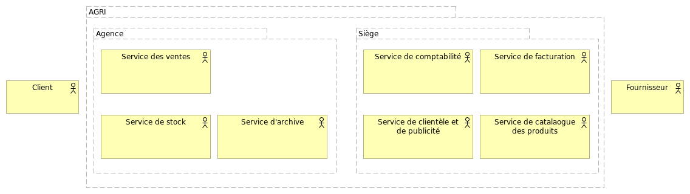
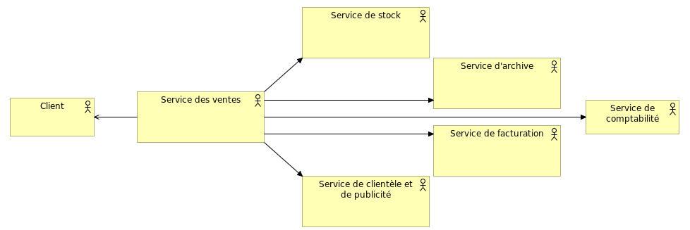
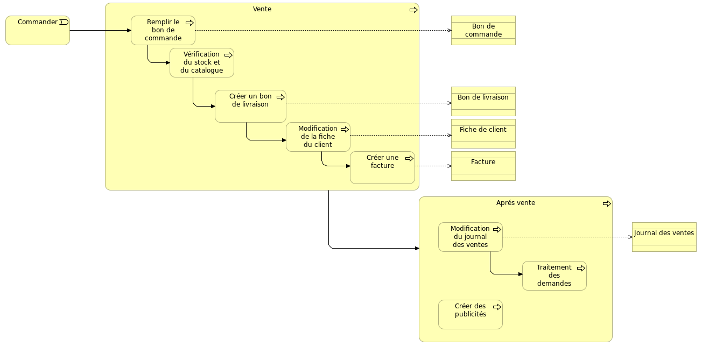
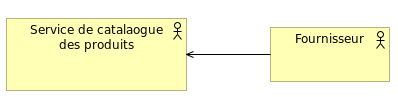
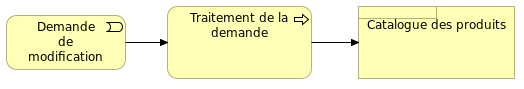
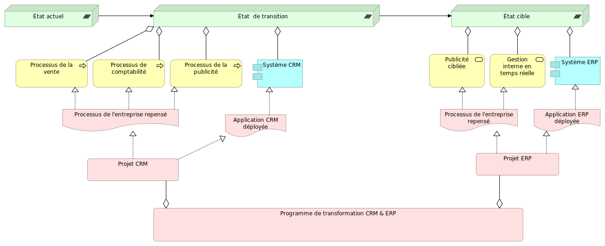

# AGRI Architecture

# Plan

## 1 - Introduction
L'architecture d'entreprise (AE) est une discipline qui permet de gérer les approches conflictuelles au sein des organisations. Cette discipline, consacrée tant au monde de l'informatique qu'à celui du métier, introduit des normes pratiques dans les différentes unités et départements afin d'optimiser l'utilisation des ressources disponibles.Cette étude de cas illustre l’intérêt du langage de modélisation ArchiMate pour le développement et la mise en œuvre de l’EA chez l'entreprise Agri.AGRI est une entreprise specialiste dans la vente des produits agricoles et cette étude illustre principalement les couches centrales du langage ArchiMate appliquee a Agri comme example ainsi que ses deux extensions : Motivation et implémentation et Migration.

## 2 - Présentation de l'entreprise Agri
## 2.1 - Context général de l'entreprise Agri

> L’activité de la société AGRI consiste en la vente des produits agricoles vers un ensemble de clients qui peuvent être soit des distributeurs détaillants ou alors des particuliers. Elle est composée de trois agences et un siège principal. Cette décomposition de l'entreprise permet de bien cerner les tâches des agences et de siège. Par conséquent, nous pouvons dégager les acteurs avec les quels ils travaillent, les services offers par chacun parmi eux, et les processuses englobés.Le tableau suivant résume les différents service ainsi que ses procèdes , acteur at son département.

|Services|Procédés|Acteurs|Département|
|----------|----------|-------------|---------|
|Vente|Vente: répondre aux commandes des clients, Facturation , Livraison au clients|Client, équipe vente|agence|
|Achat|Achat, Facturation|Fournisseur, Direction|siège|
|Facturation|Facturation des commandes|équipe de facturation|siège|
|Comptabilité|Comptabilité|équipe de comptabilité|siège|
|Stock|gestion des stocks|équipe de stock|agence|
|Resource humain|gestion des resources humains|équipe de resources humains|siège|

## 2.2 - Structure organisationnelle

> D'aprés la partie précédent nous avons retenu la conclusion suivante:
> - L'entreprise Agri est composée en deux types de département:
>  * Agences ont une intéraction directe avec le client.
>  * Siège représent le back-office et s'occupe plus des services de comptabilité, etc. Il communique également avec les fournisseurs.
> - Chaque département est composée d'un ensemble des services.
> En prenant cela en consédiration, nous avons arrivés à réaliser le shéma suivant qui représente d'une manière exhaustive, mais claire, l'ensemble des services et les interactions que l'entreprise aura eventuellement avec son environement.

 
## 2.3 - Processes rescensés

> Dans la partie suivante on va essayer de comprendre comment la société Agri gère sont travail. Donc, on va essayer de lister les processes englobés dans son métier.Pour le faire, on va commencer par les processes reliés au client, puis ceux de fournisseurs.

> - Le client est en générale intervient dans les services de ventes et d'aprés ventes, tels que la publicité. On peut comprendre plus concrétement les services qui doit servire ce dernier de schéma suivant:

> On peut voire clairement ces processes d'aprés le schéma suivants:

> - En ce qui concerne le fournisseur, ses interventions sont semèstrielles et ont comme objective la mise-à-jour de catalogue des produits:

> Le schéma suivante montre ce processus de changement de catalogue:

## 2.4 - Problematique de l'entreprise Agri
## 3 - Motivations pour la transformation digitale

   > 

## 4 - Vision cible pour l'entreprise Agri

   ### 4.1- Mise en œuvre et migration
   Les problématiques citées précédemment nous pousse à repenser à des solutions stratégiques qui peuvent améliorer la chaine de vente de l’entreprise Agri. En effet l’intégration d'un système d’information pourra être une partie intégrante de la stratégie de l’entreprise qui permettra de surmonter ses difficultés pour gérer efficacement la traçabilité entre les briques d’architecture du système et les besoins exprimés à l’origine du projet ; et encore plus à justifier des décisions d’architectures vis-à-vis de ces attentes. 
   En prenant en considération des améliorions au niveau de l’architecture d’Agri, celle-ci dorénavant possède un GPS qui lui guide dans ses choix au fur et à mesure des différentes étapes à traverser, en réduisant l’incertitude et en fournissant les informations nécessaires à la bonne évaluation des différentes possibilités. 

Au niveau métier, cette amélioration va permettre à l’entreprises de définir sa stratégie et de clarifier sa vision, mission et objectifs grâce à l’évaluation des facteurs de changements tel que des facteurs métiers ou de régulation. Elle permet ensuite de planifier les capacités métiers nécessaires pour atteindre les objectifs définis, et de définir une stratégie et une tactique pour chaque objectif. 

Une fois les capacités métiers planifiés, les directions informatiques vont pouvoir planifier les fonctionnalités IT, les applications, les technologies et l’infrastructure nécessaires pour pouvoir supporter les métiers. 

L’architecture d’entreprise améliorée fournit ainsi à Agri des feuilles de route métier et IT claires qui laissent peu de place à l’incertitude. Couplée à la gestion des risques métier et IT, les améliorations qu’on va présenter permet de réduire les risques liés à toute transformation en évaluant leur impact et leur probabilité, et en mettant en place des plans d’actions visant à réduire ces risques. 

Le diagramme suivant propose comment nous pouvant mener à bien cette Migration dans l'architecture de l'entreprise Agri. 

   ### 4.2- Architecture de l'entreprise cible
   
   ### 4.2.1- Vision d'adoption du CRM chez Agri

   ### 4.2.2- Vision d'adoption d'un ERP chez Agri

## 5 - Avantages de la nouvelle architecture

### 5.1 - Exemple de scénario pour l’état cible

### 5.2 - Les avantages
## 6 - outiles de réalisation
   ### 6.1 - Présentation de l'outil ArchiMate
   ArchiMate fournit des outils pour aider les architectes d'entreprise à décrire, analyser et visualiser les relations entre les différents domaines de l'architecture d'une manière non ambiguë, similaire à ces disciplines bien établies comme le génie civil ou le bâtiment et la construction en utilisant des normes internationalement acceptées pour décrire leurs conceptions.

ArchiMate est une technique de modélisation pour décrire les architectures d'entreprise. Il présente un ensemble clair de concepts et de relations entre les domaines d'architecture, et offre une structure simple et uniforme pour décrire le contenu de ces domaines. Tout comme un dessin d'architecture dans l'architecture classique du bâtiment décrit les différents aspects de la construction et de l'utilisation d'un bâtiment.

Les principaux avantages d'ArchiMate pour la modélisation de vos architectures d'entreprise sont :
   * Il s'agit d'une norme internationale et indépendante des fournisseurs de The Open Group, vous libérant du verrouillage des outils et des cadres spécifiques aux fournisseurs. Il y a un soutien actif du Forum ArchiMate de The Open Group.
   * Ses concepts et modèles bien fondés apportent de la précision. Il vous aide à vous éloigner de l'image des « images floues » de l'architecture.
   * C'est un langage léger et simple. Il contient juste assez de concepts pour modéliser l'architecture d'entreprise et n'est pas pléthorique pour inclure tout ce qui est possible.
   * Sa structure uniforme le rend facile à apprendre et à appliquer.
   * Il a des liens clairs avec les approches existantes pour des domaines d'architecture spécifiques tels que les logiciels ou les processus métier.
   * Plusieurs concepts d'ArchiMate ont été délibérément empruntés à d'autres langages tels que UML ou BPMN, pour fournir un pont facile.
   * Il ne prescrit pas de méthode de travail, mais il se combine facilement avec des méthodes existantes telles que TOGAF.
   * Il a été essayé et testé par de nombreuses organisations d'utilisateurs différentes et est soutenu par de nombreux consultants et outils logiciels. 
## 6 - Conclusion

